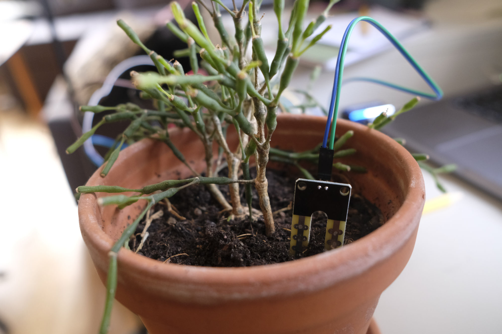
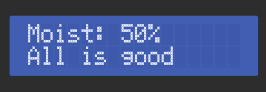
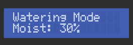

# User Manual

## Introduction

This user manual provides step-by-step instructions for effectively using Watering Buddy, ensuring a seamless experience. It includes guidance on setup, daily operations, and maintenance.

## Setup and Installation

The setup process is divided up into steps below:

1. Put the soil moisture sensor into a pot of choice.
2. Put the UV sensor also in the pot.
3. Power on the Arduino using a 5V power supply via USB-C or using a 9V battery.

## Operation

The Arduino will handle most of the tasks by itself but there are a few things the user has control over. Such as:

- How moist the optimal soil should be.

### LEDs

- The green LED indicates a good amount of water in the soil.

- The yellow LED indicates (between the green and red LED) indicates slightly dry soil.

- The red LED indicates too little water in the soil.

- The blue LED indicates too much water in the soil.

### Using the Menu

The menu can be navigated using the buttons provided with the product. 
- BUTTON 1 is used for navigation. It has functionality for short press and long press.
- BUTTON 2 is to decrease value (context based) 
- BUTTON 3 is to increase value (context based)

___

#### Page 1: Moisture display

**BUTTON 1:**

|  **Long press**  | **Short press** |
|  :-   | :-: |
| Enter watering mode | Change display to next page
  
___

#### Page 2: Light display

**BUTTON 1:**
|  **Long press**  | **Short press** |
|  :-   | :-: |
| Enter Light/UV Fast Mode | Change display to next page

___

#### Page 3: Moisture center value

**BUTTON 1:**
|  **Long press**  | **Short press** |
|  :-   | :-: |
| Enter adjustment mode for moisture | Change display to next page

___

#### Page 4: Watering mode 

When in watering mode measurements are continous, happening every second

**BUTTON 1:**
|  **Long press**  | **Short press** |
|  :-   | :-: |
| N/A |  Exit watering mode

___

#### Page 5: Light/UV fast mode 

When in light/UV fast mode measurements are continous, happening every second

**BUTTON 1:**
|  **Long press**  | **Short press** |
|  :-   | :-: |
| N/A |  Exit light/UV fast mode

___

#### Page 6: Adjust Moisture Thresholds

In this mode you can adjust the threshold for moisture. The center value is in the middle of the good span and is used to calculate thresholds. A value of 60% will give Wet above 70%, Good between 51-70%, Semidry between 25-50% and Dry < 25%

**BUTTON 1:**
|  **Long press**  | **Short press** |
|  :-   | :-: |
| N/A |  Exit adjust moisture threshold mode

**BUTTON 2:**

|  **Long press**  | **Short press** |
|  :-   | :-: |
| N/A |  Decrease center threshold value

**BUTTON 3:**

|  **Long press**  | **Short press** |
|  :-   | :-: |
| N/A |  Increase center threshold value

